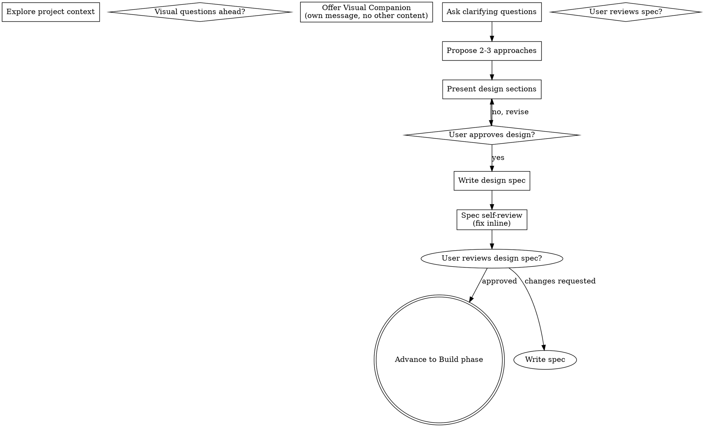

# Plan Workflow

Help turn ideas into fully formed design specs through natural collaborative dialogue.

Start by understanding the current project context, then ask questions one at a time to refine the idea. Once you understand what you're building, present the design and get user approval.

The result is a durable Markdown design spec in the local project at:

```text
docs/specs/YYYY-MM-DD-<topic>.md
```

## Checklist

You MUST create a task for each of these items and complete them in order:

1. **Explore project context** — check files, docs, recent commits
2. **Offer visual companion** (if topic will involve visual questions) — this is its own message, not combined with a clarifying question. See the Visual Companion section below.
3. **Ask clarifying questions** — one at a time, understand purpose/constraints/success criteria
4. **Propose 2-3 approaches** — with trade-offs and your recommendation
5. **Present design** — in sections scaled to their complexity, get user approval after each section
6. **Write design spec** — save to `docs/specs/YYYY-MM-DD-<topic>-design.md` and commit
7. **Spec self-review** — quick inline check for placeholders, contradictions, ambiguity, scope (see below)
8. **User reviews written spec** — ask user to review the spec file before proceeding
9. **Transition to Build phase** — ask the user if they would like to advance to the Build phase (`./build.md`).

## Process Flow



**The terminal state is advancing to Build phase.** Do NOT invoke any other implementation skill. The ONLY workflow you invoke after Plan is Build.

## The Process

**Understanding the idea:**

- Check out the current project state first (files, docs, recent commits)
- Before asking detailed questions, assess scope: if the request describes multiple independent subsystems (e.g., "build a platform with chat, file storage, billing, and analytics"), flag this immediately. Don't spend questions refining details of a project that needs to be decomposed first.
- If the project is too large for a single spec, help the user decompose into a high level roadmap with sub-projects: what are the independent pieces, how do they relate, what order should they be built? Then brainstorm the first sub-project. Each sub-project gets its own spec.
- For appropriately-scoped projects, ask questions one at a time to refine the idea
- Prefer multiple choice questions when possible, but open-ended is fine too
- Only one question per message - if a topic needs more exploration, break it into multiple questions
- Focus on understanding: purpose, constraints, success criteria

**Exploring approaches:**

- Propose 2-3 different approaches with trade-offs
- Present options conversationally with your recommendation and reasoning
- Lead with your recommended option and explain why

**Presenting the design:**

- Once you believe you understand what you're building, present the design
- Scale each section to its complexity: a few sentences if straightforward, up to 200-300 words if nuanced
- Ask after each section whether it looks right so far
- Cover: architecture, components, acceptance criteria,data flow, error handling, testing
- Be ready to go back and clarify if something doesn't make sense

**Design for isolation and clarity:**

- Break the system into smaller units that each have one clear purpose, communicate through well-defined interfaces, and can be understood and tested independently
- For each unit, you should be able to answer: what does it do, how do you use it, and what does it depend on?
- Can someone understand what a unit does without reading its internals? Can you change the internals without breaking consumers? If not, the boundaries need work.
- Smaller, well-bounded units are also easier for you to work with - you reason better about code you can hold in context at once, and your edits are more reliable when files are focused. When a file grows large, that's often a signal that it's doing too much.

**Working in existing codebases:**

- Explore the current structure before proposing changes. Follow existing patterns.
- Where existing code has problems that affect the work (e.g., a file that's grown too large, unclear boundaries, tangled responsibilities), include targeted improvements as part of the design - the way a good developer improves code they're working in.
- Don't propose unrelated refactoring. Stay focused on what serves the current goal.

## After the Design

**Documentation:**

- Write the validated design spec to `docs/specs/YYYY-MM-DD-<topic>-design.md`
  - (User preferences for spec location override this default)
- Make the spec implementation-ready. It should capture the agreed design, constraints, sequencing, implementation phases, risks, and verification guidance so the Build phase can proceed without re-planning.
- Use the section names, format, and level of detail below as guidance, not a rigid template. Omit sections that do not fit the work. Add sections when they make the spec easier to review or execute.
- Consider sections like:
  - `Goal` - the outcome and source of truth.
  - `Reference mocks`, `References`, or `Source of truth` - links to roadmap sections, screenshots, prior specs, designs, or examples.
  - `Current state` or `Verified current state` - what already exists, what is working, and what gaps remain.
  - `Constraints` and `Out of scope` - explicit boundaries, non-goals, and governing rules.
  - `Architecture` - component relationships, boundaries, data flow, and a Mermaid diagram when relationships matter.
  - `Implementation phases` - ordered phases with the approach, likely files, and acceptance tie-ins for each phase.
  - `Sequencing` - dependency order, parallelizable work, and rollout notes.
  - `Verification` or `Testing and acceptance` - unit, integration, manual, UAT, and command-level checks.
  - `Risks and mitigations` - specific risks with practical mitigations.
  - `Key files` or `Suggested file map` - likely files or areas affected, without inventing unverified APIs.
  - `Explicitly deferred work` - related work intentionally left out.
  - `Build handoff` - approved scope, non-goals, ordered phases, required verification, fixtures, risks, and blocking questions.
- Keep implementation detail at the task-shaping level. Include phases, likely files, and acceptance checks; avoid large pasted code blocks or exact APIs that have not been verified in the repo.
- Commit the design spec to git

**Spec Self-Review:**
After writing the spec document, look at it with fresh eyes:

1. **Placeholder scan:** Any "TBD", "TODO", incomplete sections, or vague requirements? Fix them.
2. **Internal consistency:** Do any sections contradict each other? Does the architecture match the feature descriptions?
3. **Scope check:** Is this focused enough for a single implementation plan, or does it need decomposition?
4. **Ambiguity check:** Could any requirement be interpreted two different ways? If so, pick one and make it explicit.

Fix any issues inline. No need to re-review — just fix and move on.

**User Review Gate:**
After the spec review loop passes, ask the user to review the written spec before proceeding:

> "Spec written and committed to `<path>`. Please review it and let me know if you want to make any changes."

Wait for the user's response. If they request changes, make them and re-run the spec review loop. Only proceed once the user approves.

**Build phase:**

- ask the user if they would like to advance to the Build phase (`./build.md`).
- Do NOT invoke any other skill. writing-plans is the next step.

## Key Principles

- **One question at a time** - Don't overwhelm with multiple questions
- **Multiple choice preferred** - Easier to answer than open-ended when possible
- **YAGNI ruthlessly** - Remove unnecessary features from all designs
- **Explore alternatives** - Always propose 2-3 approaches before settling
- **Incremental validation** - Present design, get approval before moving on
- **Be flexible** - Go back and clarify when something doesn't make sense
