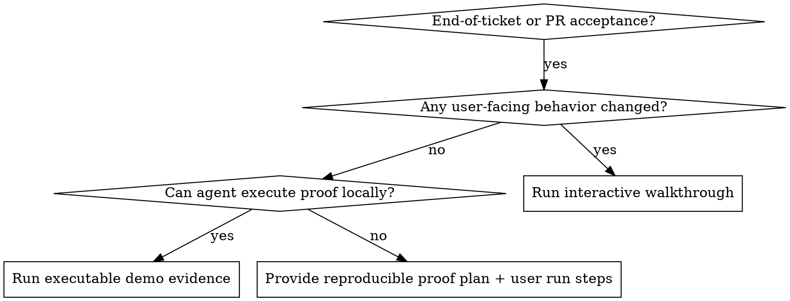

# Running User Acceptance Walkthroughs

## Overview

Acceptance at delivery time should be experiential, not just a test summary.
Primary goal: help the human directly see and feel what changed before merge.
If work is not user-facing, run and show executable proof with user-impact translation.

## When to Use

- End of PR/ticket prompts: "UAT", "verify", "walk me through", "show what changed", "can we merge?"
- Sign-off requests where confidence requires direct observation, not only CI output
- Mixed work (UI + backend/infrastructure) that needs both walkthrough and proof

Do not use for mid-implementation debugging or code-quality review without acceptance intent.

## Decision Flow



## Output Contract

1. Start with an overview: succinctly describe what was built.
2. Summarize the scope: in 2-5 bullets (what changed, in user terms).
3. Declare `Mode`: `user-facing`, `non-user-facing`, or `mixed`.
4. Validate in small slices with explicit pass/fail capture per slice.
5. End with `Recommendation`: `GO`, `GO with follow-ups`, or `NO-GO`.

## Mode Playbooks

### User-facing mode

- Provide explicit instructions: e.g.,

```bash
# Step 1: Start the app from the project root
pnpm tauri:dev
# Step 2: Click the "Generate Report" button in the dashboard
# Step 3: Observe the new "Export to CSV" option in the dropdown
```

- Guide one scenario at a time: user action -> expected result -> what to report.
- Wait for user confirmation before moving to next scenario.
- Ask at least one "does this feel right?" UX confidence question.
- Prefer hands-on preview over abstract summary.

### Non-user-facing mode

- Execute demonstrable proof: targeted tests, runnable commands, logs, traces, or metrics.
- Show exact commands and key result lines (not raw dump).
- Translate technical output into user impact.
- Offer one short trust-check the user can run independently.

### Mixed mode

- Run user-facing walkthrough first.
- Then run backend/infrastructure proof tied to the same user outcome.

## Quick Reference

| Mode            | First step                   | Evidence required                         | Done when                                 |
| --------------- | ---------------------------- | ----------------------------------------- | ----------------------------------------- |
| user-facing     | Start interactive scenario 1 | User-observed behavior                    | User confirms pass/fail for all scenarios |
| non-user-facing | Run proof command(s)         | Command output + impact translation       | Reproducible evidence reviewed            |
| mixed           | User scenario first          | Both user observation and technical proof | Both layers accepted                      |

## Common Mistakes

- Dumping a static checklist with no interaction
- Reporting only test counts with no demonstration
- Skipping non-UI demo because there is no frontend change
- Declaring merge readiness before collecting explicit pass/fail signals

## Rationalization Table

| Excuse                                             | Reality                                                                          |
| -------------------------------------------------- | -------------------------------------------------------------------------------- |
| "No UI changes, so UAT is just unit tests."        | Non-user-facing work still needs demonstrable proof and user-impact explanation. |
| "We are in a rush, give a fast merge checklist."   | Time pressure increases need for clear GO/NO-GO evidence.                        |
| "I already summarized everything; that is enough." | Summaries do not replace user experience or executable demonstration.            |
| "User can test later after merge."                 | Acceptance belongs before merge unless explicitly deferred by user.              |

## Red Flags - Stop and Correct

- You are about to send only a summary/checklist.
- You cannot point to any observed behavior or executed proof.
- You are treating CI green status as equivalent to acceptance.
- You are asking for merge without an explicit acceptance signal.
